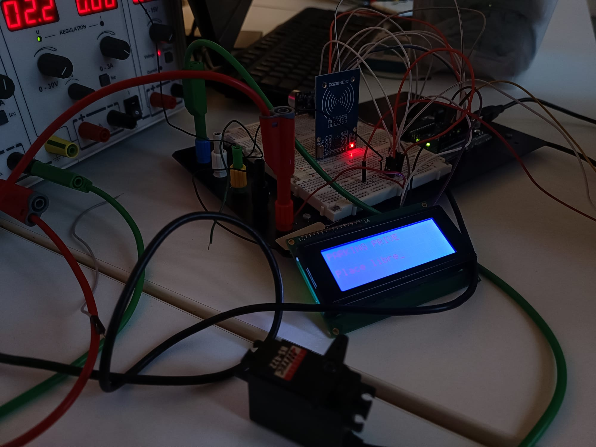
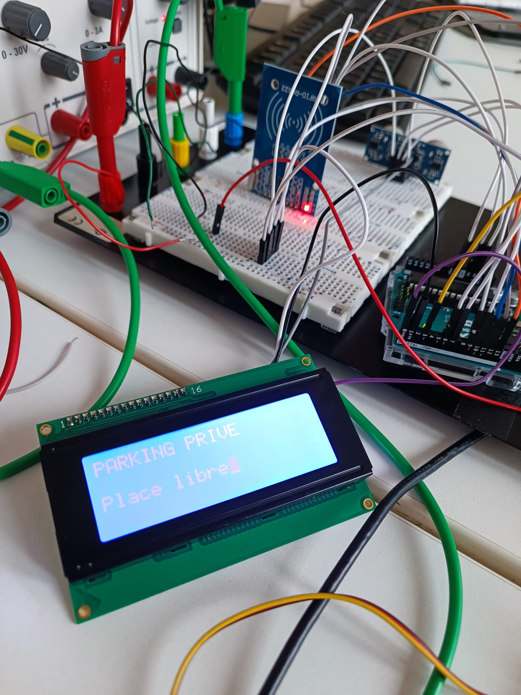
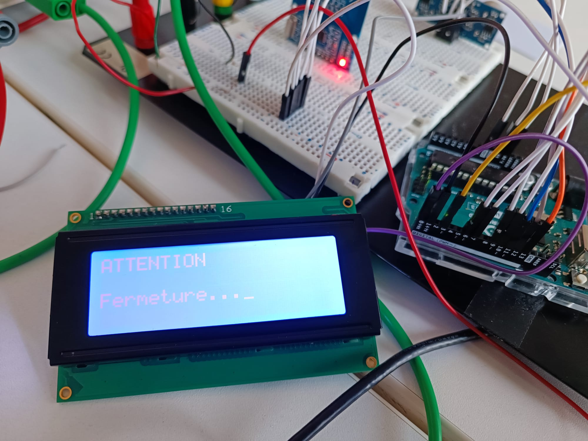
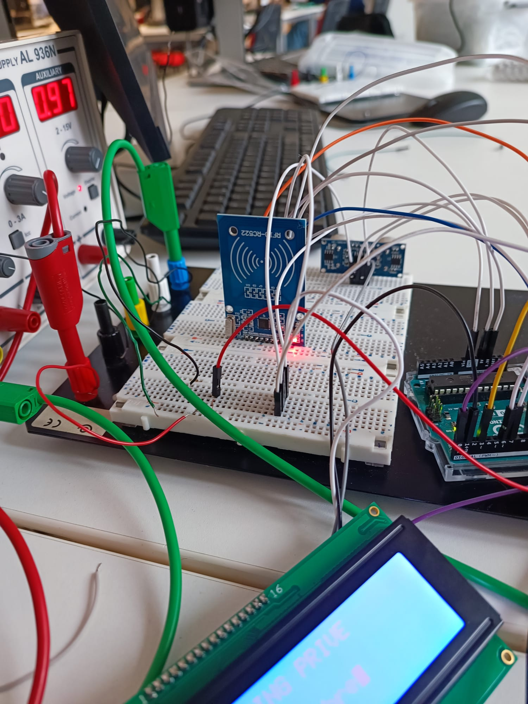

# Parking Automatisé avec Arduino

## Auteur
Projet réalisé par Youness BEN SBEH – CPI2 (ISTY)

---

## Objectif du projet

Concevoir et réaliser un système automatisé de gestion d’accès pour parking, intégrant :
- un contrôle d’entrée sécurisé (RFID)
- une sortie automatisée (capteur ultrason)
- un système de sécurité (détection d’obstacle)
- une interface utilisateur (écran LCD et buzzer)

Objectif : simuler un système embarqué proche des applications industrielles (automobile, smart parking).

---

## Architecture du système

Le système est composé de trois blocs principaux :

### 1. Gestion d’accès (Entrée)
- Lecture badge RFID (RC522)
- Vérification UID autorisé
- Commande du servomoteur (barrière)

### 2. Gestion de sortie
- Détection véhicule via HC-SR04
- Ouverture automatique de la barrière

### 3. Sécurité et interaction
- Radar de proximité (ultrason)
- Buzzer (alerte progressive)
- Affichage LCD en temps réel

---

## Fonctionnement global

1. Lecture du badge RFID
2. Vérification de l’accès
3. Ouverture de la barrière si autorisé
4. Surveillance des obstacles
5. Fermeture sécurisée
6. Détection automatique de sortie

---

## Aperçu du système

---

## Interface utilisateur

---

## Sécurité

---

## Démonstration

Voir la vidéo : [Lien vidéo](media/Video_Démo_2.mp4)

---

## Matériel utilisé

- Arduino Uno R3
- Lecteur RFID RC522
- Capteur ultrason HC-SR04
- Servomoteur
- Écran LCD série
- Buzzer
- Breadboard
- Fils de connexion

---

## Partie électronique (RFID)

---

## Câblage

Utiliser la breadboard pour répartir proprement le 5V et le GND.

### Alimentation générale
- 5V Arduino → rail rouge (+)
- GND Arduino → rail bleu (-)

### Écran LCD
- Pin 1 → 5V
- Pin 2 → GND
- Pin 3 (RX) → Pin 1 (TX) Arduino
- Pin 4 → non connecté

Important : débrancher le fil TX pendant le téléversement.

### Capteur ultrason
- VCC → 5V
- GND → GND
- Trig → Pin 6
- Echo → Pin 7

### Servomoteur
- Rouge → 5V
- Noir/Marron → GND
- Jaune/Orange → Pin 3

### RFID RC522 (3.3V obligatoire)
- 3.3V → Arduino
- RST → Pin 9
- GND → GND
- MISO → Pin 12
- MOSI → Pin 11
- SCK → Pin 13
- SDA → Pin 10

### Buzzer
- + → Pin 4
- - → GND

---

## Bibliothèques utilisées

- SPI
- MFRC522
- Servo

---

## Contraintes et limites

- Sensibilité du capteur ultrason aux perturbations
- Consommation du servomoteur
- Gestion d’un seul badge autorisé

---

## Améliorations possibles

- Gestion de plusieurs badges
- Ajout Bluetooth ou WiFi
- Compteur de places disponibles
- Historique des accès
- Interface mobile

---

## Compétences mobilisées

- Programmation embarquée (Arduino / C++)
- Communication SPI (RFID)
- Traitement de capteurs
- Conception système
- Analyse fonctionnelle
